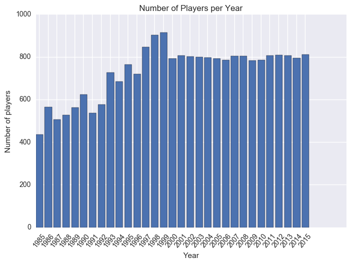
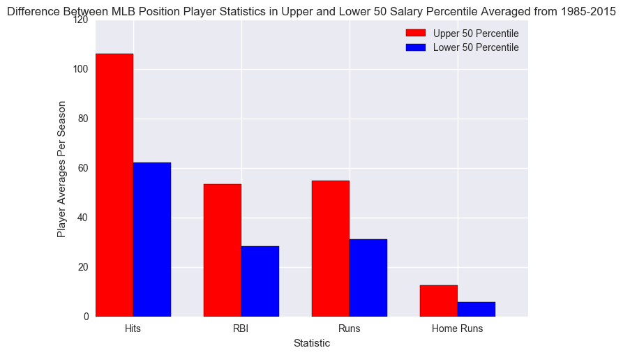
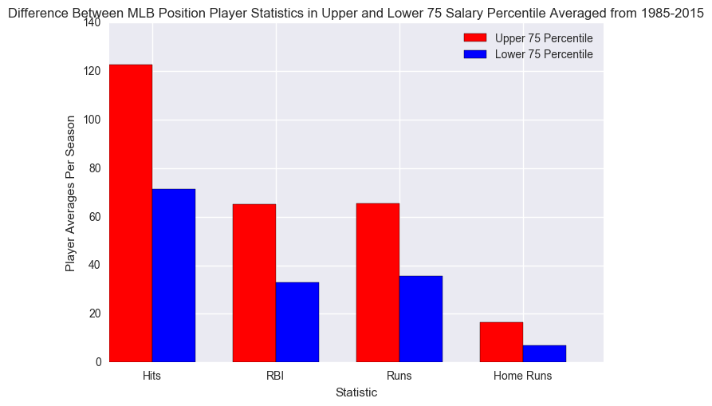
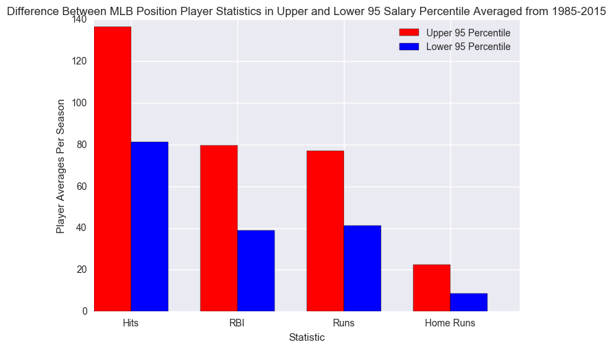
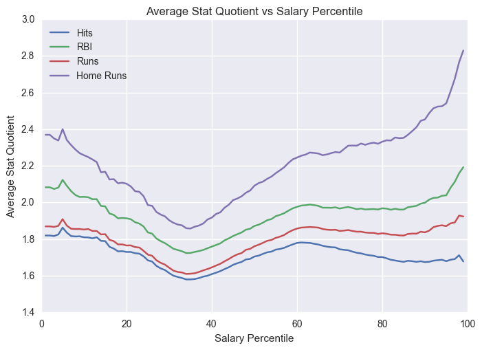
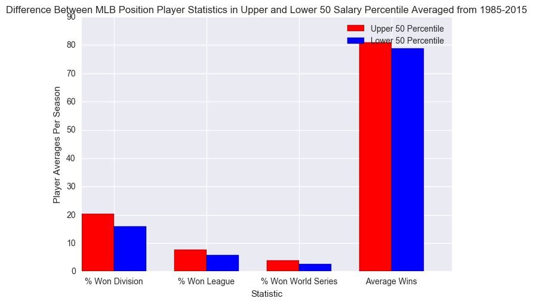
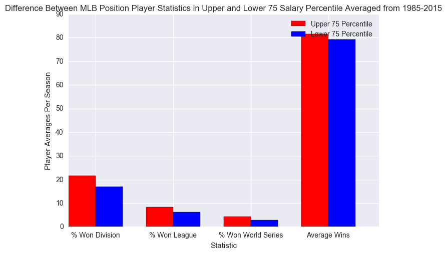
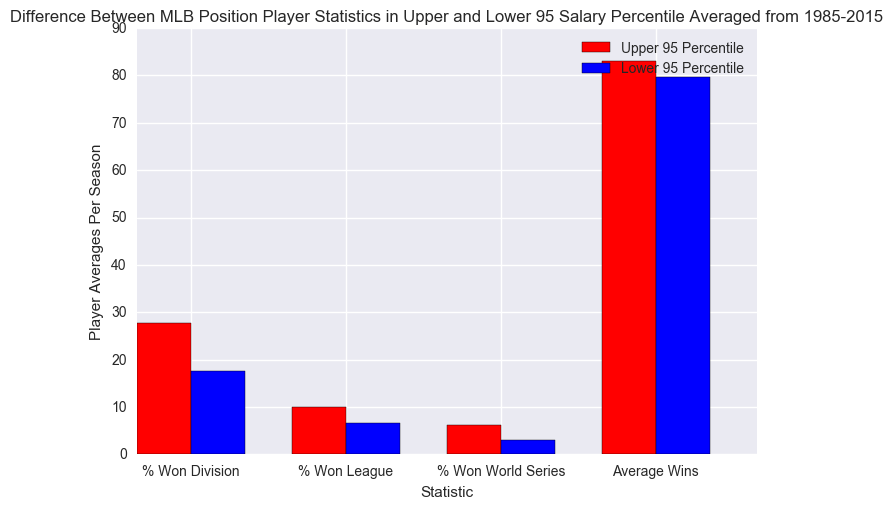
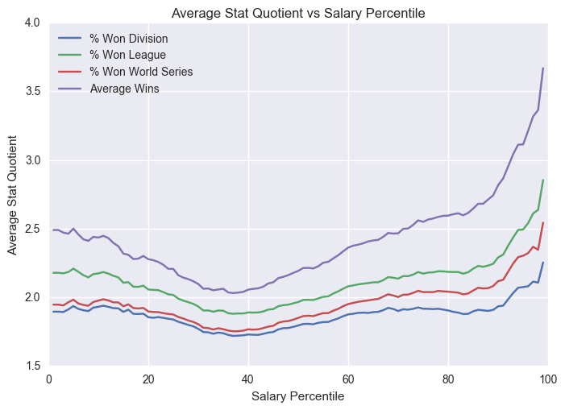
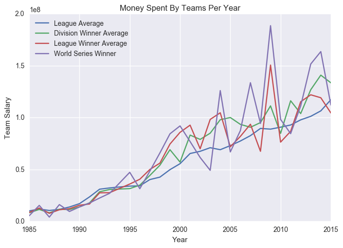

Are high salaried players worth it? Do teams that spend lots of money on their players win more games or championships?


```python
import pandas as pd
import numpy as np
import matplotlib.pyplot as plt
import seaborn as sns
```

I'm using the following files to get information on the following:

Batting - offensive stats such as hits, runs, RBI, and home runs

Salaries - player salaries

Fielding - player position

Teams - wins, and whether they won their division, league, and World Series


```python
batting = pd.read_csv('core/Batting.csv')
salaries = pd.read_csv('core/Salaries.csv')
fielding = pd.read_csv('core/Fielding.csv')
teams = pd.read_csv('core/Teams.csv')[['yearID','lgID','teamID','W','DivWin','LgWin','WSWin']]
```

I merged the player data based on player ID's, year, and team ID. This ensures each player for each year has his own field. The reason for merging on team ID is to ensure that a player gets a new field if he is traded mid-season.


```python
player_data = batting.merge(fielding, on=['playerID','yearID','teamID'])
player_data = player_data.merge(salaries, on=['playerID','yearID','teamID'])
player_data = player_data.merge(teams, on=['yearID','lgID','teamID'])
```

I subset the dataframe to only include columns I care about in this analysis.


```python
required_columns = ['playerID','yearID','teamID','lgID','R','H','HR','RBI','POS','salary','W','DivWin','LgWin','WSWin']
```


```python
player_data = player_data[required_columns]
```


```python
player_data[['R', 'H', 'HR', 'RBI']].isnull().sum()
```


    R      1877
    H      1877
    HR     1877
    RBI    1877
    dtype: int64


Before continuing the analysis, I want to remove all data points with NaN values for runs, hits, home runs, and RBI. As seen in the previous cell, there are 1877 of these data points.


```python
null_condition = player_data['R'].isnull() | player_data['H'].isnull() | player_data['HR'].isnull() | player_data['RBI'].isnull()
```


```python
player_data = player_data[~null_condition]
```

Next, I want to remove duplicate players. For players that play multiple positons, there are multiple data points for the same player that only differ in the 'POS' (position) column. By dropping duplicates that have the same playerID, yearID and teamID, I am only removing these players.


```python
player_data.drop_duplicates(['playerID','yearID','teamID'], inplace=True)
```

In my analysis, I will be separating players by salary percentile. Rather than taking the percentile of all of the data at once, I first group the data by year to account for inflation and paying practices that change every season. Once the data is grouped, I separate the players by upper and lower percentile and return two separate data frames.


```python
# Separates players in upper percentile and lower percentile categories. The percentile is specified as an argument.
# Returns two lists-- list[0] contains the upper percentile while list[1] contains lower percentile.
def separate_players_by_percentile(player_df, percentile):
    
    grouped_by_year = player_df.groupby('yearID')
    
    upper_percentile_list = []
    lower_percentile_list = []
    
    for year, player_list in grouped_by_year:
        
        salary_percentile = np.percentile(player_list['salary'], percentile)
        
        for x, player in player_list.iterrows():
            if player['salary'] > salary_percentile:
                upper_percentile_list.append(player)
            else:
                lower_percentile_list.append(player)
    
    upper_percentile_df = pd.DataFrame(upper_percentile_list)
    lower_percentile_df = pd.DataFrame(lower_percentile_list)
    
    return [upper_percentile_df, lower_percentile_df]
```


```python
# Creates bar chart that compares upper and lower percentile players based on their stats.
def make_bar_chart(stats_by_percentile, data_labels, percentile):
        
    n_groups = len(stats_by_percentile)
        
    #plots bar graphs
    fig, ax = plt.subplots()
    index = np.arange(n_groups)
    bar_width = .35

    upper_percentile_bars = plt.bar(index, stats_by_percentile['Upper Percentile'], bar_width, color='r', label='Upper ' + str(percentile) + ' Percentile')
    lower_percentile_bars = plt.bar(index + bar_width, stats_by_percentile['Lower Percentile'], bar_width, color='b', label='Lower ' + str(percentile) + ' Percentile')

    plt.xlabel('Statistic')
    plt.ylabel('Player Averages Per Season')
    plt.title('Difference Between MLB Position Player Statistics in Upper and Lower ' + str(percentile) + ' Salary Percentile Averaged from 1985-2015')
    plt.xticks(index + bar_width, data_labels)
    plt.legend()
        
    plt.show()
```


```python
offensive_data_fields = ['H', 'RBI', 'R', 'HR']
offensive_data_labels = ['Hits', 'RBI', 'Runs', 'Home Runs']
```

I chose to remove pitchers from my analysis because I'm focusing on offensive statistics.


```python
position_player_data = player_data[player_data['POS'] != 'P']
```

I decided to compare offensive stats (hits, RBI, runs, and home runs) from 3 salary percentiles: 50th, 75th, and 95th.

Each bar chart has the average stat players had per season, averaged from 1985-2015. The red bars represent players in the upper percentile, while the blue bars represent players in the lower percentile.

To get an idea of how many data points there are per year, I created a bar graph depicting this.


```python
player_count_per_year = player_data.groupby('yearID')['playerID'].count()
```


```python
index = np.arange(len(player_count_per_year))
plt.bar(index, player_count_per_year)
plt.xticks(index+.35, player_count_per_year.index.values, rotation=50)
plt.ylabel('Number of players')
plt.xlabel('Year')
plt.title('Number of Players per Year')
plt.show()
```





This dataset has a fairly constant number of players every year. Since I will be comparing player averages per year, this is good news.


```python
def get_player_averages_by_percentile_df(player_df, percentile):
    separated_data = separate_players_by_percentile(player_df, percentile)
    offensive_data = pd.DataFrame([])
    offensive_data['Upper Percentile'] = np.mean(separated_data[0].groupby('yearID')[offensive_data_fields].mean())
    offensive_data['Lower Percentile'] = np.mean(separated_data[1].groupby('yearID')[offensive_data_fields].mean())
    
    return offensive_data
```


```python
offensive_50_percentile = get_player_averages_by_percentile_df(position_player_data, 50)
```


```python
make_bar_chart(offensive_50_percentile, offensive_data_labels, 50)
```





Players in the upper 50th percentile performed much better in all categories. The greatest difference is in home runs, with upper percentile players hitting almost twice as many as lower percentile players.


```python
offensive_75_percentile = get_player_averages_by_percentile_df(position_player_data, 75)
```


```python
make_bar_chart(offensive_75_percentile, offensive_data_labels, 75)
```





As with the previous chart, higher percentile players still outperform lower percentile players. The differences between percentile doesn't change much, which I didn't expect.


```python
offensive_95_percentile = get_player_averages_by_percentile_df(position_player_data, 95)
```


```python
make_bar_chart(offensive_95_percentile, offensive_data_labels, 95)
```





From these charts we can see that in all 3 cases, players who make more money perform much better offensively. I wanted to get a more quantitative sense of how much better upper percentile salary players were compared to lower percentile players. Therefore, I took the quotient of the upper percentile average and lower percentage average for each stat. For the rest of this project, I'll refer to this number as the "average stat quotient". This number gives us the rate at which upper salary percentile players achieved a stat compared to lower salary percentile players. 

To illustrate how players in higher percentiles perform compared to their counterparts, I decided to plot the average stat quotient as a function of percentile.


```python
def plot_quotient_trend(percentile_list, quotients_df, data_labels):
    
    for i in range (0, len(quotients_df)):
        plt.plot(quotients_df.iloc[i])
    

    plt.legend(data_labels, loc='upper left')
    plt.xlabel('Salary Percentile')
    plt.ylabel('Average Stat Quotient')
    plt.title('Average Stat Quotient vs Salary Percentile')
    plt.show()
```


```python
offensive_quotients = pd.DataFrame([])
```


```python
percentile_list_1_100 = list(range(1, 100))
```


```python
for i in range (1, 100):
    offensive_data = get_player_averages_by_percentile_df(position_player_data, i)
    offensive_quotients[str(i)] = offensive_data['Upper Percentile'] / offensive_data['Lower Percentile']
```


```python
plot_quotient_trend(percentile_list_1_100, offensive_quotients, offensive_data_labels)
```





The averages for all of the stats followed a very similar pattern. The averages start at a maximum and decrease until they hit a depression at the 35th percentile. They then increase until they hit a local maximum at the 60th percentile. From there, home runs continue to increase until the end, while the other stats slowly decrease and reach a local minimum at the 90th percentile. After that, all stats increase until the 99th percentile.

The best deals are from players in the the 5th, 60th, and 95th percentiles, while the worst deals are in the 35th and 90th percentiles.

From this data, it can be said that players paid in the 90+ percentiles get hits, RBI, runs, and home runs at rates much higher than lesser paid players. However, this doesn't prove if teams with higher salaried players win more games or championships. After all, baseball is a team sport.

I decided to calculate to calculate the average wins each player had per season and the percentage of players who won their division, league, and the World Series. I did that for players in the 50th, 75th, and 95th percentiles.


```python
#replaces 'Y' with 1 and 'N' with 0 in DivWin, LgWin and WSWin columns of table
def convert_yes_and_no_to_bool(x):
    if x == 'Y':
        return 1
    else:
        return 0
```


```python
player_data.loc[:, 'DivWin'] = player_data['DivWin'].apply(convert_yes_and_no_to_bool)
player_data.loc[:, 'LgWin'] = player_data['LgWin'].apply(convert_yes_and_no_to_bool)
player_data.loc[:, 'WSWin'] = player_data['WSWin'].apply(convert_yes_and_no_to_bool)
```


```python
team_data_labels = ['% Won Division', '% Won League', '% Won World Series' ,'Average Wins']
```


```python
all_player_percentile_50 = separate_players_by_percentile(player_data, 50)

team_50_percentile = pd.DataFrame([])
team_50_percentile['Upper Percentile'] = np.mean(all_player_percentile_50[0].groupby('yearID')['DivWin', 'LgWin', 'WSWin'].mean()*100)
team_50_percentile['Lower Percentile'] = np.mean(all_player_percentile_50[1].groupby('yearID')['DivWin', 'LgWin', 'WSWin'].mean()*100)

wins_50_list = [[np.mean(all_player_percentile_50[0].groupby('yearID')['W'].mean()),
                 np.mean(all_player_percentile_50[1].groupby('yearID')['W'].mean())]]

team_50_percentile = team_50_percentile.append(pd.DataFrame(wins_50_list, columns=['Upper Percentile', 'Lower Percentile'], index=['W']))
```


```python
make_bar_chart(team_50_percentile, team_data_labels, 50)
```





According to this chart, players in the top 50% are slightly more likely to win more games and have better chances at winning the division, league, and World Series.


```python
all_player_percentile_75 = separate_players_by_percentile(player_data, 75)
team_75_percentile = pd.DataFrame([])
team_75_percentile['Upper Percentile'] = np.mean(all_player_percentile_75[0].groupby('yearID')['DivWin', 'LgWin', 'WSWin'].mean()*100)
team_75_percentile['Lower Percentile'] = np.mean(all_player_percentile_75[1].groupby('yearID')['DivWin', 'LgWin', 'WSWin'].mean()*100)

wins_75_list = [[np.mean(all_player_percentile_75[0].groupby('yearID')['W'].mean()),
                np.mean(all_player_percentile_75[1].groupby('yearID')['W'].mean())]]

team_75_percentile = team_75_percentile.append(pd.DataFrame(wins_75_list, columns=['Upper Percentile', 'Lower Percentile'], index=['W']))
```


```python
make_bar_chart(team_75_percentile, team_data_labels, 75)
```





The trends in this chart don't much as compared to the 50th percentile, however they still indicate that higher percentile players are still slightly more likely to win than lower percentile players.


```python
all_player_percentile_95 = separate_players_by_percentile(player_data, 95)
team_95_percentile = pd.DataFrame([])
team_95_percentile['Upper Percentile'] = np.mean(all_player_percentile_95[0].groupby('yearID')['DivWin', 'LgWin', 'WSWin'].mean()*100)
team_95_percentile['Lower Percentile'] = np.mean(all_player_percentile_95[1].groupby('yearID')['DivWin', 'LgWin', 'WSWin'].mean()*100)

wins_95_list = [[np.mean(all_player_percentile_95[0].groupby('yearID')['W'].mean()),
                np.mean(all_player_percentile_95[1].groupby('yearID')['W'].mean())]]

team_95_percentile = team_95_percentile.append(pd.DataFrame(wins_95_list, columns=['Upper Percentile', 'Lower Percentile'], index=['W']))
```


```python
make_bar_chart(team_95_percentile, team_data_labels, 95)
```





The most significant differences between upper and lower percentile players can be seen in this chart. The chances of winning the division, league, and World Series are much higher among the upper percentile players. The most striking difference is the chance of winning the World Series, where upper percentile players are nearly twice as likely to win than lower percentile players.

To see how players in all percentiles performed, I decided to plot the average stat quotients from the 1st to 99th percentiles.


```python
team_quotients = pd.DataFrame([])
```


```python
percentile_list_1_100 = list(range(1, 100))
```


```python
for i in range (1, 100):
    team_data = get_player_averages_by_percentile_df(player_data, i)
    team_quotients[str(i)] = team_data['Upper Percentile'] / team_data['Lower Percentile']
```


```python
plot_quotient_trend(percentile_list_1_100, team_quotients, team_data_labels)
```





I was surprised to see this plot follows a very similar trend to the one for offensive stats. The trend starts at a local maximum and decreases until the 35th percentile, where it reaches a minimum. It then increases to a local maximum at the 70th percentile. Average wins continues to increase until the end, while the other stats decrease and hit a local minimum at the 90th percentile, after which they increase until the end.

This plot would indicate that having players in the 5th, 70th, and 95th+ percentiles should increase a teams chances of winning. To investigate this further, I calculated the average amount of money spent on salaries per team each year and compared them to salaries for teams who win their division, league, and World Series.


```python
team_average_salary_by_year = salaries.groupby(['yearID','teamID'])['salary'].sum().groupby(level = 'yearID').mean()
```


```python
division_winner_salaries = player_data[player_data['DivWin']==1]
division_winner_average_salaries_by_year = division_winner_salaries.groupby(['yearID', 'teamID'])['salary'].sum().groupby(level = 'yearID').mean()
```


```python
league_winner_salaries = player_data[player_data['LgWin']==1]
league_winner_average_salaries_by_year = league_winner_salaries.groupby(['yearID', 'teamID'])['salary'].sum().groupby(level = 'yearID').mean()
```


```python
world_series_winner_salaries = player_data[player_data['WSWin']==1]
world_series_winner_salary_by_year = world_series_winner_salaries.groupby(['yearID'])['salary'].sum()
```


```python
plt.plot(team_average_salary_by_year)
plt.plot(division_winner_average_salaries_by_year)
plt.plot(league_winner_average_salaries_by_year)
plt.plot(world_series_winner_salary_by_year)
plt.xlabel('Year')
plt.ylabel('Team Salary')
plt.title('Money Spent By Teams Per Year')
plt.legend(['League Average', 'Division Winner Average', 'League Winner Average', 'World Series Winner'], loc='upper left')
plt.show()
```





This plot suggests that the most successful teams spend more than the league on average. This is especially true for World Series winners, whose trend was consistently the highest on the plot, with a few exceptions. Most notably in 2003, where the World Series winner spent much less than the league average. I also found it interesting that the hierarchy of achievement also corresponded to higher salary. By first glance, I see that division winners spend more than than the league average, league winners spend more than division winners, and World Series winners spend more than league winners.

Conclusion:

I conclude that highly paid players are worth it, considering how much better they are at getting hits, runs, RBI, and especially home runs. They also have higher chances of winning more games, their divisions, leagues, and the World Series. However, I define highly paid players as players in the 95th+ percentiles. I make this distinction because, according to the charts in cells 27 and 40, players in the 90th percentile perform just as well as players from the 75th percentile and up. Therefore paying players in the 75th percentile a much better deal. 

While these are substantial findings, it should be known that there are limitations in this analysis. When analyzing team stats, I took individual player salary's and compared them against stats that determined how successful their teams are. For example, if I found that highly paid players won more World Series than their counterparts, I concluded that wealthy players are more likely to win the World Series. However, I did not take the amount of highly paid players per team in to consideration. Therefore, it's possible that having only one highly paid player isn't enough to increase a team's chances of winning a World Series. A good next step would be to analyze the quantity of highly paid players per team, and comparing that against the team's success.
